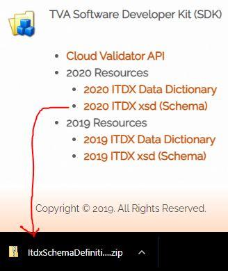
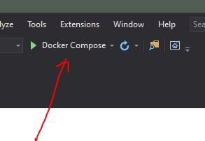
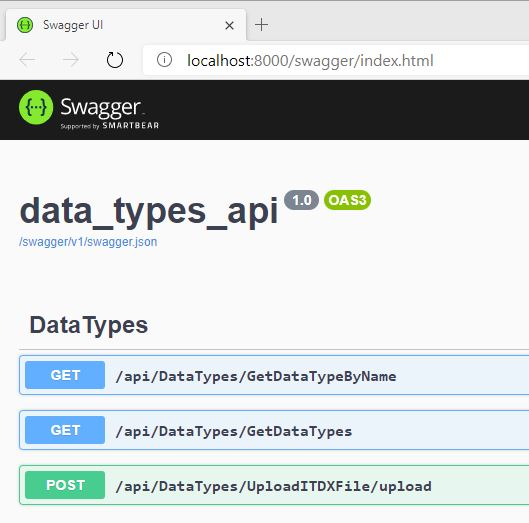
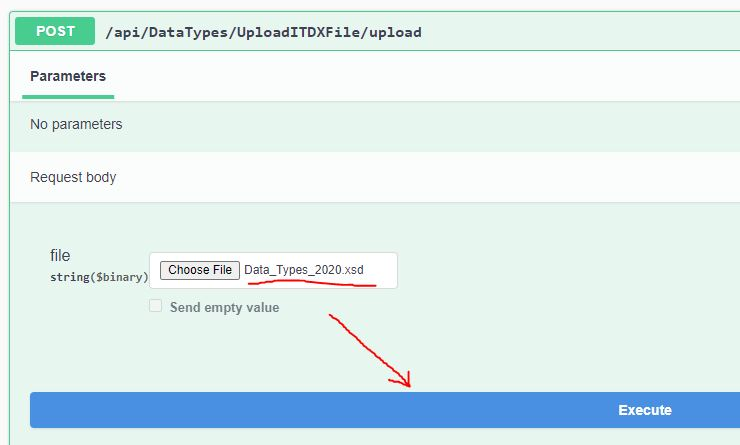

# otr_itdx_data_types
Microservice to host/cache ITDX Data types.

## Prerequisites
  
Docker

Microsoft Visual Studio Community 2019 Preview Version 16.9.0 Preview 2.0 or newer.

Data_Types_2020.xsd file (not included in the repo).

You find this file at http://www.traumavendoralliance.org/resources/

Unzip package and find file Data_Types_2020.xsd.  You need this file to hydrate microservice cache.

## Directions
1. Clone or download
2. Run Docker compose in VS 2019

3. Navigate to http://localhost:8000/swagger/index.html and select POST then click the "Try it out" button.

4. Select "Choose File" and navigate to the Data_Types_2020.xsd in the package you unzipped earlier.  Click "Execute".

Step 4 will only need to be done the first time the application is run as the data types are persisted to a container redis-volume defined in --appendonly mode.  Please see the docker-compose file. This will allow the data_types_db redis container to be destroyed and recreated easily.

Method /api/DataTypes/GetDataTypes returns a list of available ITDX data types.

Method /api/DataTypes/GetDataTypeByName returns the full json data type detail of any of the data types listed in the GetDataTypes method.

For example:

http://localhost:8000/api/DataTypes/GetDataTypeByName?name=Sex

returns

{
  "name": "Sex",
  "description": "The patient's sex.",
  "data_Type_Record_List": [
    {
      "code": "1",
      "description": "Male"
    },
    {
      "code": "2",
      "description": "Female"
    }
  ]
}
